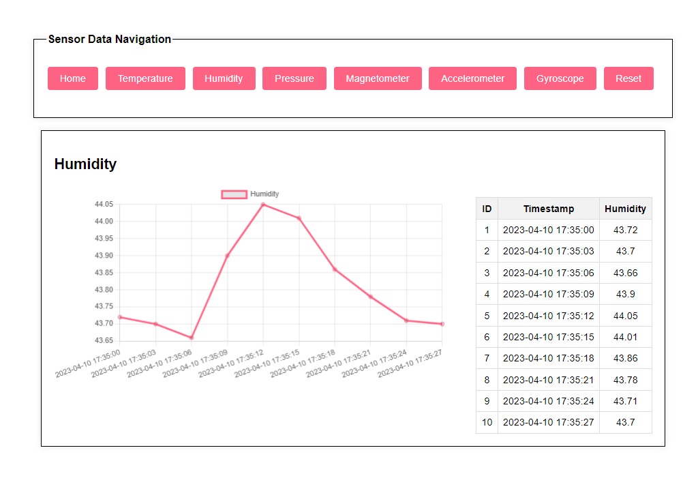
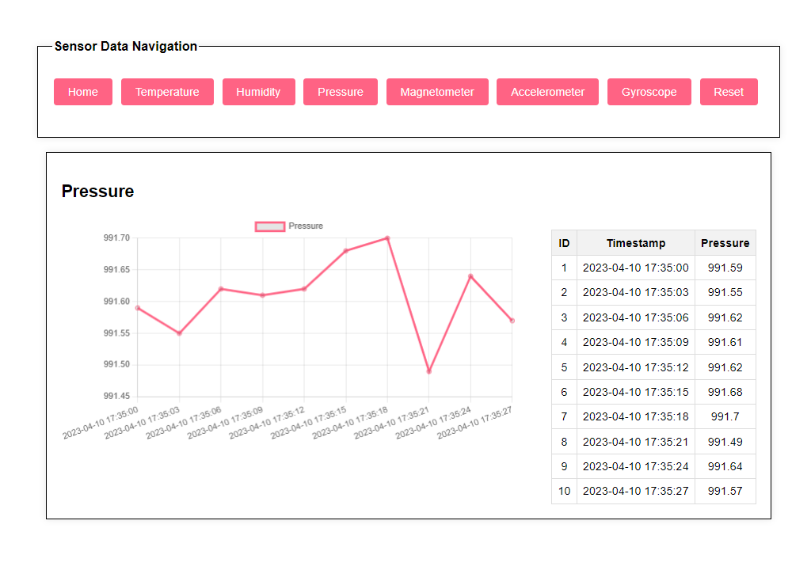

# IoT-Weather-Monitor
STM32 microcontroller collects sensor data and transmits it over the internet using a TCP Client-Server connection, data is then interpreted with Graph.js.

# Languages and Technologies Used

### `C, PHP, MySQL, and STM32CubeMX`

# About this project

# The Process
This project integrates the use of a STM32 microcontroller to collect sensor data and transmit it over the internet. The firmware for the microcontroller is coded with C. Hosting it's own TCP server, data collected was sent through packets to a TCP client where it saves received items to a SQLite database.

A front-end web server set up in PHP is then used to display the data to the users, extracted from the database and interpreted to a graph using Chart.js, as seen above.
